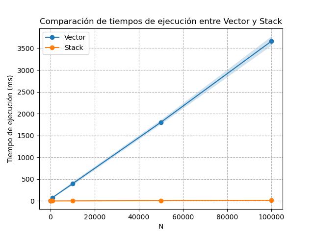

<style>
p {
    text-align: justify;
}

/* Estilo para el borde y el fondo general del callout */
div.callout.consola-terminal {
    background-color: #1e1e1e !important; /* Gris muy oscuro, estilo VS Code */
    border: 1px solid #444 !important;
    border-radius: 5px;
}

/* Estilo para la barra del título */
div.callout.consola-terminal .callout-header {
    background-color: #2d2d2d !important;
    color: #cccccc !important;
    font-family: 'Consolas', 'Courier New', monospace;
    border-bottom: 1px solid #444 !important;
}

/* Estilo para el texto de la salida (cuerpo) */
div.callout.consola-terminal .callout-body-container {
    color: #10B981 !important; /* Verde brillante estilo Matrix/Consola clásica */
    font-family: 'Consolas', 'Courier New', monospace;
    font-size: 0.95em;
}

/* Contenedor título + botón de descarga */
.exercise-title-row {
	display: flex;
	align-items: center;
	gap: 0.75rem;
	flex-wrap: wrap;
}

.exercise-download-btn {
	font-size: 0.85rem;
	text-decoration: none;
	border: 1px solid #0d6efd;
	color: #0d6efd;
	border-radius: 6px;
	padding: 0.2rem 0.55rem;
	line-height: 1.2;
	transition: all 0.15s ease;
}

.exercise-download-btn:hover {
	background-color: #0d6efd;
	color: #ffffff;
	text-decoration: none;
}

@media (max-width: 640px) {
	.exercise-download-btn {
		font-size: 0.8rem;
	}
}
</style>

<script>
document.addEventListener("DOMContentLoaded", function() {
	const downloadMap = {
		"Implementación con vector": [{ file: "ej_vector.cpp", label: "Descargar ej_vector.cpp" }],
        "Implementación con stack": [{ file: "ej_stack.cpp", label: "Descargar ej_stack.cpp" }],
	};

	const headings = document.querySelectorAll("main h2");

	headings.forEach((h2) => {
		const title = h2.textContent.trim();
		const files = downloadMap[title];
		if (!files) return;

		const row = document.createElement("span");
		row.className = "exercise-title-row";

		const titleSpan = document.createElement("span");
		titleSpan.textContent = title;
		row.appendChild(titleSpan);

		files.forEach((item) => {
			const link = document.createElement("a");
			link.href = item.file;
			link.download = item.file;
			link.className = "exercise-download-btn";
			link.textContent = item.label;
			row.appendChild(link);
		});

		h2.textContent = "";
		h2.appendChild(row);
	});
});
</script>


# Estanislao Claucich

A continuación se presentan las soluciones a los ejercicios propuestos en el GTP2.


::: {.callout-note title="Consigna"}
Escribir un generador de IDs `struct idgen_t` que nos permita:  
- Obtener IDs únicos a medida que se necesitan.  
- Liberarlos a medida que no se utilizan más.  
- Obtener la cantidad total de IDs activos y la lista de ellos.  

Se deben implementar dos versiones de este generador: una utilizando `std::vector` y otra utilizando `std::stack`. Se pueden usar otras estructuras auxiliares si se considera necesario.
:::


## Implementación con vector

En este enfoque, utilizamos un `std::vector<bool> busy` para llevar un registro de qué IDs están activos y cuáles están libres. Se establece una variable estática `IDMAX` que define el número máximo de IDs que se pueden generar. De esta forma, esto será una clara limitación de esta implementación, ya que de antemano estamos fijando un límite máximo de IDs. Lo cual puede ser un problema si no sabemos de antemano cuántos IDs vamos a necesitar (ya sea que usemos menos o que necesitemos más).

`busy[id]` nos indicará si el `id` está activo (true) o libre (false). Para obtener un nuevo ID, simplemente buscamos el primer índice en `busy` que sea `false`, lo marcamos como `true` y lo devolvemos. Para liberar un ID, simplemente marcamos su índice en `busy` como `false`. Para obtener la cantidad total de IDs activos, contamos cuántos elementos en `busy` son `true`. Para obtener la lista de IDs activos, recorremos `busy` y recopilamos los índices que son `true`.

Otro de los problemas de esta implementación es que la operación `get` es $O(N)$ en el peor caso, ya que podríamos tener que recorrer todo el vector para encontrar un ID libre. Esto puede ser ineficiente si el número de IDs es grande y muchos están activos. Lo mismo sucede con el método `size`, porque al devolver la cantidad de IDs donde `busy[id]` es `true`, también es necesario recorrer todo el vector para contar cuántos IDs están activos, lo cual también es $O(N)$.

La operación `release` es $O(1)$, ya que simplemente marcamos un índice como `false` sin necesidad de recorrer el vector.

:::{.callout-tip title="Comentarios"}
Para simplificar la explicación de las implementaciones se incluyen comentarios en el código fuente donde se considera necesario.
:::


```cpp
#include <iostream>
#include <vector>

using namespace std;

const int IDMAX = 100;

struct idgen_t {
  vector<bool> busy;

  // Inicializa el generador
  void init() {
    // Siempre nos ajustamos a un tamaño fijo
    busy.resize(IDMAX);
    // Establecemos todos como libres al comienzo
    for (int i = 0; i < IDMAX; i++) {
      busy[i] = false;
    }
  }

  // Devuelve un nuevo ID
  int get() {
    //Recorremos el vector hasta encontrar el primero libre
    for (int id = 0; id < IDMAX; id++) {
      // Si encontramos un ID libre
      if (!busy[id]) {
        // Lo marcamos como ocupado y lo devolvemos
        busy[id] = true;
        return id;
      }
    }
    return -1;
  }

  // Libera un ID activo
  void release(int id) {
    // Verificamos que el ID sea válido antes de liberarlo
    if (0 <= id && id < IDMAX) {
      busy[id] = false;
    }
  }

  // Retorna la cantidad total de IDs activos
  int size() {
    // Simplemente contamos cuántos IDs están marcados como ocupados
    int count = 0;
    for (bool occupied : busy) {
      if (occupied) {
        count++;
      }
    }
    return count;
  }

  // Devuelve la lista de IDs activos actualmente
  vector<int> active() {
    // Guardamos todos los IDs que están marcados 
    // como ocupados en un vector y lo devolvemos
    vector<int> actives;
    for (int id = 0; id < IDMAX; id++) {
      if (busy[id]) {
        actives.push_back(id);
      }
    }
    return actives;
  }

  // Libera todos los IDs activos
  void clear() {
    for (int id = 0; id < IDMAX; id++) {
      busy[id] = false;
    }
  }
};
```

A continuación se muestra un ejemplo con un `main` que genera 20 IDs, luego libera los IDs pares y finalmente genera 10 nuevos IDs. Se muestra la cantidad de IDs activos y la lista de IDs activos después de cada operación.

```cpp
void main() {
  idgen_t idgen;
  idgen.init();

  int N = 20;

  cout << "Generando " << N << " IDs..." << endl;
  for (int i = 0; i < N; i++) {
    cout << idgen.get() << " ";
  }
  cout << endl;
  cout << "size " << idgen.size() << endl;
  dump(idgen);
  
  cout << "Liberando IDs pares..." << endl;
  for (int i = 0; i < N; i += 2) {
    idgen.release(i);
  }
  cout << "size " << idgen.size() << endl;
  dump(idgen);

  cout << "Generando 10 IDs más..." << endl;
  for (int i = 0; i < 10; i++) {
    cout << idgen.get() << " ";
  }
  cout << endl;
  cout << "size " << idgen.size() << endl;
  dump(idgen);
}
```

:::{.callout-note .consola-terminal icon=false title="bash"}
Generando 20 IDs...  
0 1 2 3 4 5 6 7 8 9 10 11 12 13 14 15 16 17 18 19   
size 20  
IDs activos: 0 1 2 3 4 5 6 7 8 9 10 11 12 13 14 15 16 17 18 19   
Liberando IDs pares...  
size 10  
IDs activos: 1 3 5 7 9 11 13 15 17 19   
Generando 10 IDs más...  
0 2 4 6 8 10 12 14 16 18   
size 20  
IDs activos: 0 1 2 3 4 5 6 7 8 9 10 11 12 13 14 15 16 17 18 19  
:::


## Implementación con stack
En este caso utilizamos un `std::stack<int> free` para almacenar los IDs que han sido liberados y están disponibles para ser reutilizados. Además, mantenemos una variable `last` que indica el siguiente ID a asignar si no hay IDs libres en la pila.  

Para obtener un nuevo ID, primero verificamos si hay IDs libres en la pila `free`. Si los hay, simplemente tomamos el ID de la cima de la pila y lo devolvemos. Si no hay IDs libres, asignamos el ID indicado por `last`, incrementamos `last` y devolvemos el ID asignado. Para liberar un ID, simplemente lo agregamos a la pila `free`. Para obtener la cantidad total de IDs activos, calculamos la diferencia entre `last` y el tamaño de la pila `free`, ya que `last` representa el total de IDs asignados y el tamaño de `free` representa los IDs que han sido liberados. 

En este caso, la operación `get` es $O(1)$, ya que simplemente obtenemos el último ID libre de la pila o bien, usamos el valor de `last`. La operación de `size` también es $O(1)$, ya que solo implica una resta, al igual que la operación `release` al simplemente agregar un elemento a la pila.

```cpp
#include <iostream>
#include <vector>
#include <stack>

using namespace std;

struct idgen_t {
  int last;
  stack<int> free;

  // Inicializa el generador
  void init() {
    // Último ínice libre (al comienzo es 0)
    last = 0;
    // Eliminamos todos los elementos de la pila de IDs libres
    while (!free.empty()) {
      free.pop();
    }
  }

  // Devuelve un nuevo ID
  int get() {
    // Si hay IDs libres en la pila
    if (!free.empty()) {
      int id = free.top();
      free.pop();
      return id;
    }
    // Si no hay libres, creamos uno nuevo
    int id = last;
    last++;
    return id;
  }

  // Libera un ID activo
  void release(int id) {
    free.push(id);
  }

  // Retorna la cantidad total de IDs activos
  int size() {
    return last - (int)free.size();
  }

  // Devuelve la lista de IDs activos actualmente
  vector<int> active() {
    vector<int> actives;
    stack<int> temp = free;
    vector<int> freed;
    while (!temp.empty()) {
      freed.push_back(temp.top());
      temp.pop();
    }
    
    for (int id = 0; id < last; id++) {
      bool is_free = false;
      for (int f : freed) {
        if (f == id) {
          is_free = true;
          break;
        }
      }
      if (!is_free) {
        actives.push_back(id);
      }
    }
    return actives;
  }

  // Libera todos los IDs activos
  void clear() {
    last = 0;
    while (!free.empty()) {
      free.pop();
    }
  }
};
```

Utilizando el mismo `main` que en la implementación con `vector`, podemos ver que se obtiene prácticamente la misma salida. Hay diferencias solamente en el orden en el que se generan los nuevos IDs después de liberar los pares, ya que en la implementación con `stack` se reutilizan los IDs liberados en orden inverso al que fueron liberados (LIFO), mientras que en la implementación con `vector` se asignan los IDs libres en orden ascendente:

:::{.callout-note .consola-terminal icon=false title="bash"}
Generando 20 IDs...  
0 1 2 3 4 5 6 7 8 9 10 11 12 13 14 15 16 17 18 19   
size 20  
IDs activos: 0 1 2 3 4 5 6 7 8 9 10 11 12 13 14 15 16 17 18 19   
Liberando IDs pares...  
size 10  
IDs activos: 1 3 5 7 9 11 13 15 17 19   
Generando 10 IDs más...  
18 16 14 12 10 8 6 4 2 0   
size 20  
IDs activos: 0 1 2 3 4 5 6 7 8 9 10 11 12 13 14 15 16 17 18 19
:::


## Análisis de complejidad

Para verificar la diferencia en complejidad algorítmica, se evaluó el tiempo de ejecución de cada implementación para generar y liberar `N` IDs, con una cantidad `N` creciente. De esta forma podemos ver cómo la implementación con `vector` se vuelve cada vez más lenta a medida que `N` crece. En cambio, la implementación con `stack` mantiene un tiempo de ejecución prácticamente constante, incluso para valores grandes de `N`.

Se evaluó lo mencionado anteriormente con los valores de `N` dados por `vector<int> Ns = {10, 100, 1000, 10000, 50000, 100000}`, y para tener sustancia estadśitica, se repitió cada prueba 5 veces y se tomó el promedio (la sombra muestra la desviación estándar).   

A continuación se muestra el `main` correspondiente a esta evaluación utilizada en ambas implementaciones de `idgen_t`:

```cpp
int main() {
  idgen_t idgen;
  
  vector<int> Ns = {10, 100, 1000, 10000, 50000, 100000};
  
  for (int N : Ns) {
    idgen.init();
    auto start = chrono::high_resolution_clock::now();

    for (int i = 0; i < N; i++) {
      idgen.get();
    }

    for (int i = 0; i < N; i++) {
      idgen.release(i);
    }

    for (int i = 0; i < N; i++) {
      idgen.get();
    }
  
    auto end = chrono::high_resolution_clock::now();
    auto duration = chrono::duration_cast<chrono::milliseconds>(end - start);
    cout << "Tiempo de ejecución para " << N <<
     ": " << duration.count() << " ms" << endl;
  }

  return 0;
}
```

En la siguiente figura se muestra la comparación de tiempos de ejecución entre ambas implementaciones en función de `N`. Claramente se observa que la implementación con `vector` tiene un tiempo de ejecución que crece significativamente a medida que `N` aumenta, mientras que la implementación con `stack` mantiene un tiempo de ejecución prácticamente constante, lo cual es consistente con el análisis de complejidad realizado anteriormente. Ajustando un polinomio a los tiempos de ejecución del `vector`, se obtiene una pendiente prácticamente igual a 2, indicando un orden lineal en función de $N^2$.

:::{.callout-tip title="Aclaración"}
Anteriormente se mencionó que la operación `get` en la implementación con `vector` es $O(N)$, y la operación `release` $O(1)$. El orden cuadrático aparece porque la operación `get` se realiza a su vez `N` veces, resultando en el orden $O(N^2)$.  

Algo similar ocurre con la implementación con `stack`, donde la operación `get` es $O(1)$, pero al realizarse `N` veces, el orden total de la implementación con `stack` es $O(N)$.
:::

