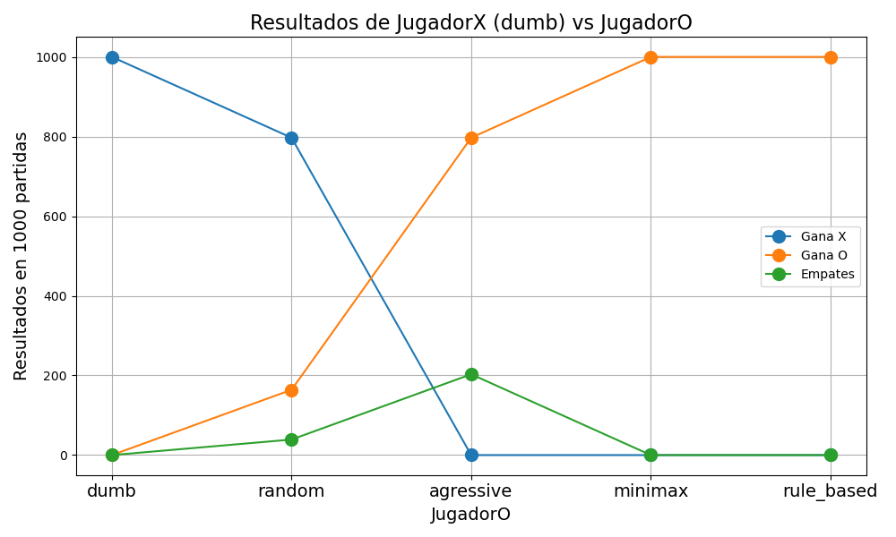
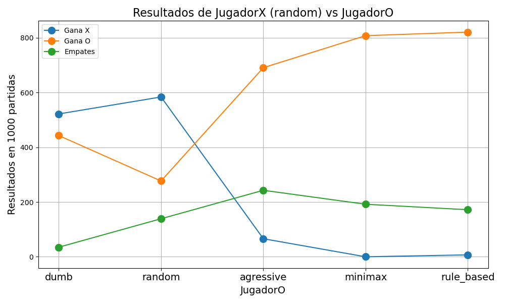
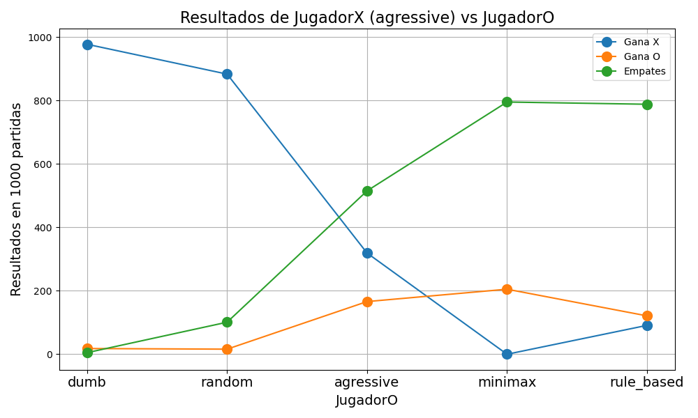
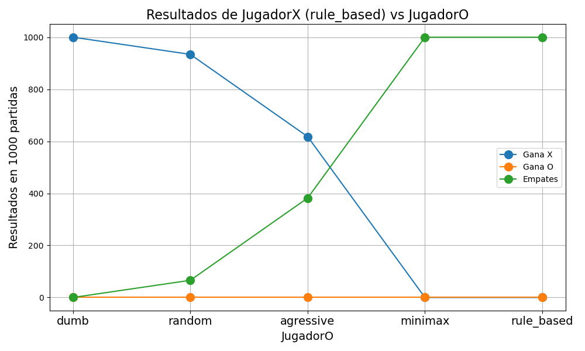

<style>
p {
    text-align: justify;
}

/* Estilo para el borde y el fondo general del callout */
div.callout.consola-terminal {
    background-color: #1e1e1e !important; /* Gris muy oscuro, estilo VS Code */
    border: 1px solid #444 !important;
    border-radius: 5px;
}

/* Estilo para la barra del título */
div.callout.consola-terminal .callout-header {
    background-color: #2d2d2d !important;
    color: #cccccc !important;
    font-family: 'Consolas', 'Courier New', monospace;
    border-bottom: 1px solid #444 !important;
}

/* Estilo para el texto de la salida (cuerpo) */
div.callout.consola-terminal .callout-body-container {
    color: #10B981 !important; /* Verde brillante estilo Matrix/Consola clásica */
    font-family: 'Consolas', 'Courier New', monospace;
    font-size: 0.95em;
}

/* Contenedor título + botón de descarga */
.exercise-title-row {
	display: flex;
	align-items: center;
	gap: 0.75rem;
	flex-wrap: wrap;
}

.exercise-download-btn {
	font-size: 0.85rem;
	text-decoration: none;
	border: 1px solid #0d6efd;
	color: #0d6efd;
	border-radius: 6px;
	padding: 0.2rem 0.55rem;
	line-height: 1.2;
	transition: all 0.15s ease;
}

.exercise-download-btn:hover {
	background-color: #0d6efd;
	color: #ffffff;
	text-decoration: none;
}

@media (max-width: 640px) {
	.exercise-download-btn {
		font-size: 0.8rem;
	}
}
</style>

<script>
document.addEventListener("DOMContentLoaded", function() {
	const downloadMap = {
		"La clase board_t": [{ file: "tictactoe.cpp", label: "Descargar tictactoe.cpp" }]
	};

	const headings = document.querySelectorAll("main h2");

	headings.forEach((h2) => {
		const title = h2.textContent.trim();
		const files = downloadMap[title];
		if (!files) return;

		const row = document.createElement("span");
		row.className = "exercise-title-row";

		const titleSpan = document.createElement("span");
		titleSpan.textContent = title;
		row.appendChild(titleSpan);

		files.forEach((item) => {
			const link = document.createElement("a");
			link.href = item.file;
			link.download = item.file;
			link.className = "exercise-download-btn";
			link.textContent = item.label;
			row.appendChild(link);
		});

		h2.textContent = "";
		h2.appendChild(row);
	});
});
</script>


# Estanislao Claucich

A continuación se presentan las soluciones a los ejercicios propuestos en el GTP3.


::: {.callout-note title="Consigna"}
Implementar un programa que simule el juego del ta-te-ti.

Se deben implementar diferentes tipos de jugadores que tendrán diferentes estrategias para elegir sus movimientos:  
- `dumb_t`: Elige la primera celda vacía que encuentra.  
- `random_t`: Elige una celda vacía al azar.  
- `agressive_t`: Busca jugadas que lo hagan ganar o bloqueen al oponente.  
- `minimax_t`: Implementa el algoritmo minimax para elegir la mejor jugada posible.  
- `rule_based_t`: Implementa una estrategia basada en reglas para elegir la jugada.
:::


## La clase `board_t`

Esta clase será la encargada de representar el tablero del juego, y de verificar el estado del mismo (si hay un ganador, si el tablero está lleno, etc). Además, tendrá métodos para realizar movimientos y mostrar el tablero por pantalla.  

El tablero se repesentará fácilmente con un `vector<char> b`, donde cada posición del vector representa una de las 9 casillas del tablero. Cada posición puede contener el valor `-1`, en caso de que haya jugado el jugador de las `X`, un `1`, en caso de que haya jugado el jugador de las `O`, o un `0` si la casilla está vacía.  

Al mismo tiempo, se llevará registro de en qué ronda se realizó cada movimiento. Esto se realiza con un `vector<int> rounds`, donde cada posición del vector representa una de las 9 casillas del tablero, y el valor que contiene es la ronda en la que se realizó el movimiento en esa casilla. Si la casilla está vacía, el valor será `-1`.

El constructor de esta clase será entonces simplemente:

```cpp
board_t() {
    b.assign(9,0);
    rounds.assign(9,-1);
}
```

Y cuando se necesita limpiar el tablero, se tiene el método `clear()`, que hace exactamente lo mismo que el constructor:

```cpp
void clear() {
    b.assign(9,0);
    rounds.assign(9,-1);
}
```

La clase a su vez contiene un método `wins()`, que verifica si en ese momento hay un ganador. Para esto, se define un arreglo estático `lines[8][3]`, que contiene las combinaciones de casillas que representan una victoria (las 3 filas, las 3 columnas y las 2 diagonales). Esta variable se define de forma estática y global, ya que será útil en distintas partes de la lógica del juego. El método `wins()` recorre este arreglo, y para cada combinación de casillas, suma los valores de esas casillas en el vector `b`. Si la suma es `-3`, significa que el jugador de las `X` ha ganado, y si la suma es `3`, significa que el jugador de las `O` ha ganado. Si ninguna de las combinaciones da un resultado ganador, el método devuelve `0`.

```cpp
static int lines[8][3] = {
                {0, 1, 2}, {3, 4, 5}, {6, 7, 8}, // Filas
                {0, 3, 6}, {1, 4, 7}, {2, 5, 8}, // Columnas
                {0, 4, 8}, {2, 4, 6}             // Diagonales
            };
```

```cpp
int wins() {
    for (int i = 0; i < 8; ++i) {
        // Al usar -1 y +1, podemos sumar los valores directamente
        int sum = b[lines[i][0]] + b[lines[i][1]] + b[lines[i][2]];
        
        if (sum == -3) return -1; // Ganaron las cruces (-1)
        if (sum ==  3) return  1; // Ganaron los círculos (1)
    }
    // Si ninguna fila da una suma de +3 o -3, 
    // significa que todavía no hay ganador
    return 0;
}
```

Para poder hacer que un jugador realice una jugada en alguna celda, se tiene el método `play(int player, int cell, int round=-1, bool verbose=true)`. Este método recibe como parámetros el jugador que va a realizar la jugada (que puede ser `-1` para las `X` o `1` para las `O`), la celda en la que se va a realizar la jugada (un número entre `0` y `8`, donde cada número representa una de las casillas del tablero), la ronda en la que se realiza la jugada, y un parámetro `verbose` que en caso de que sea `true`, muestra información adicional por consola.

Lo único que hace el método para guardar la jugada, es asignar el valor del parámetro `player` a la posición `cell` del tablero `b`. De esa forma se va llenando el tablero con las jugadas. A su vez, se actualiza de forma similar el vector `rounds`, asignando el valor del parámetro `round` a la posición `cell` del vector `rounds`. Así, vamos llevando un registro de en qué ronda se realizó cada jugada.

```cpp
void play(int player, int cell, int round=-1, bool verbose=true){
    if (verbose) {
        cout << "Jugador " << (player == -1 ? "X" : "O") << " juega en la celda " << cell << endl;
    }
    b[cell] = player;
    if (round != -1) rounds[cell] = round;
}
```

Esto básicamente establece la clase principal para definir el juego. Luego se definirán diferentes tipos de jugadores, con distintas estrategias que usarán el tablero definido previamente. 


## Jugador `dumb_t`  

Este es el jugador más básico que se puede implementar. Su estrategia es simplemente elegir la primera celda vacía que encuentre en el tablero, sin importar si esa jugada le da una victoria o no, o si le permite bloquear una victoria del oponente.

:::{.callout-note title="Jugadores"}
Todos los jugadores tendrán por lo menos dos métodos: `move(board_t &b, int me)` y `label()`. El método `move` es el encargado de realizar la jugada del jugador según sus reglas, y el método `label` devuelve el nombre del jugador.
:::

En este caso, el método `move` es muy simple, se recorre el vector `b` del tablero, y se devuelve la primera posición que tenga un valor de `0`, es decir, la primera celda vacía. Si no hay celdas vacías, se devuelve `-1` para indicar que no hay movimientos disponibles.

```cpp
class dumb_t {
    public:
        int move(board_t &b, int me) {
            for (int k=0; k<9; ++k) {
                if (b.b[k] == 0) 
                    return k; // Devuelve la primera celda vacía
            }
            return -1; // No hay movimientos disponibles
        }

        string label() { return "dumb";}
};
```

:::{.callout-note title="Partido entre jugadores"}
Para efectivamente configurar un partido entre dos jugadores de tipo `A` y `B`, se implementa una función `match` que recibe como parámetros dos jugadores de los tipos correspondientes. Luego, la lógica de la función es independiente del tipo de jugador, ya que se llama al método `move` de cada jugador para obtener la jugada que quieren realizar, y se utiliza el método `play` del tablero para realizar la jugada. La función también verifica después de cada jugada si hay un ganador utilizando el método `wins` del tablero. Si hay un ganador, se devuelve el resultado del partido. Si no hay un ganador y el tablero está lleno, se devuelve `0` para indicar un empate.  

La función, a su vez, permite recibir una cantidad de partidos a jugar. Esto permitirá realizar varias partidas bajo una cierta configuración para luego obtener estadísticas al respecto. El resultado de cada una de estas partidas se irá guardando en un vector de tres elementos `[victorias de X, victorias de O, empates]`, que se devolverá al finalizar todas las partidas.  

En cada partida, lo primero que se hace es crear un `board_t` vacío y mientras que haya jugadas posible, se juega. El jugador de las `X` (`-1`) siempre va primero, y dependiendo del `current_player`, se llama al método `move` del jugador correspondiente para obtener la jugada que quiere realizar. Luego se llama al método `play` del tablero para realizar la jugada, y se verifica si hay un ganador. Si es así, se actualiza el vector de resultados y se termina la partida. Si no hay un ganador y el tablero está lleno, se actualiza el vector de resultados para indicar un empate y se termina la partida. Si no hay un ganador y el tablero no está lleno, se alterna el jugador actual y se continúa jugando.
:::

```cpp
vector<int> match(dumb_t &playX, dumb_t &playO, int n_matches=1, bool verbose=true) {
    vector<int> results = {0, 0, 0}; // victorias de X, victorias de O, empates

    for (int i=0; i<n_matches; ++i) {
        srand(time(0) + i); // Cambiar la semilla para cada partida

        board_t board;
        int current_player = -1; // Cruces empieza
        int round = 0;
        while (true) {
            int move;
            if (current_player == -1) {
                move = playX.move(board, current_player);
            } else {
                move = playO.move(board, current_player);
            }

            if (move == -1) {
                results[2]++; // Empate
                break;
            }
            board.play(current_player, move, round, verbose);
            if (verbose) {
                board.dump();
            }
            round++;

            int winner = board.wins();
            if (winner != 0) {
                if (winner == -1) results[0]++; // Victoria de X
                else results[1]++; // Victoria de O
                break;
            }
            
            current_player *= -1; // Alternar jugador
        }
    }
    return results;
}
```

En el caso de dos jugadores `dumb_t` enfrentándose entre sí, el resultado es completamente determinístico e igual en todas las partidas. El jugador de las `X` siempre gana, ya que elige la primera celda y terminará completando una de las diagonales.

A continuación se muestra la salida de un partido entre dos jugadores `dumb_t`:

:::{.callout-note .consola-terminal icon=false title="bash"}
dumb vs dumb:  
Jugador X juega en la celda 0  
X . .   
. . .   
. . .   
------  
Jugador O juega en la celda 1  
X O .   
. . .   
. . .   
------  
Jugador X juega en la celda 2  
X O X   
. . .   
. . .   
------  
Jugador O juega en la celda 3  
X O X   
O . .   
. . .   
------  
Jugador X juega en la celda 4  
X O X   
O X .   
. . .   
------  
Jugador O juega en la celda 5  
X O X   
O X O   
. . .   
------  
Jugador X juega en la celda 6  
X O X   
O X O   
X . .   
------  
Gana X  
:::


## Jugador `random_t`

Este jugador también es muy básico. De todas las celdas vacías del tablero en el momento de jugar, elige una al azar. Para esto, primero se obtienen todas las celdas vacías en un vector `empty_cells`, y luego se elige una de esas celdas al azar utilizando la función `rand()`. Si no hay celdas vacías, se devuelve `-1` para indicar que no hay movimientos disponibles.

```cpp
class random_t {
    public:
        int move(board_t &b, int me) {
            vector<int> empty_cells;
            for (int k=0; k<9; ++k) {
                if (b.b[k] == 0) 
                    empty_cells.push_back(k);
            }
            if (empty_cells.empty()) return -1; // No hay movimientos disponibles
            int random_index = rand() % empty_cells.size();
            return empty_cells[random_index];
        }

        string label() { return "random";}
};
```

En el caso de que dos jugadores `random_t` se enfrenten entre sí, el resultado no es determinístico y puede variar en cada partida. Sin embargo, como se verá más adelante, el jugador que comienza la partida siempre parece tener una ventaja, ya que tiene más oportunidades de completar una línea antes de que el oponente pueda bloquearlo. Por lo tanto, es común observar que el jugador que comienza (en este caso, las `X`) gana con mayor frecuencia que el jugador que va segundo (las `O`), aunque también pueden ocurrir muchos empates.  

Si enfrentamos a un jugador `random_t` (X) contra un jugador `dumb_t` (O), es interesante ver que este último puede ser que gane, si tiene la suerte suficiente que las jugadas aleatorias del otro jugador no lleguen a bloquearlo.  

:::{.callout-note .consola-terminal icon=false title="bash"}
random vs dumb:  
Jugador X juega en la celda 5  
. . .   
. . X   
. . .   
------  
Jugador O juega en la celda 0  
O . .   
. . X   
. . .   
------  
Jugador X juega en la celda 8  
O . .   
. . X   
. . X   
------  
Jugador O juega en la celda 1  
O O .   
. . X   
. . X   
------  
Jugador X juega en la celda 6  
O O .   
. . X   
X . X   
------  
Jugador O juega en la celda 2  
O O O   
. . X   
X . X   
------  
Gana O  
:::


## Jugador `agressive_t`

Este jugador es un poco más especial, ya que tratará de buscar activamente si existe una jugada que lo haga ganar y, al mismo tiempo, buscar si el otro jugador está por ganar, para poder bloquearlo. Si no encuentra ninguna de estas dos situaciones, entonces elige una celda vacía al azar, como el jugador `random_t`. Esto ya representa un jugador que hace jugadas un poco más inteligentes que los dos anteriores, y como se puede ver en los resultados al final del documento, tiene una tasa de victorias mucho mayor que los jugadores anteriores.


:::{.callout-note title="Método `counts()`"}  
Este jugador utilizará un método de la clase `board_t` llamado `counts()`, que recibe dos vectores por referencia, `Xmarks` y `Omarks`, y los llena con la cantidad de marcas de cada jugador en cada una de las 8 líneas posibles (3 filas, 3 columnas y 2 diagonales). De esta forma, el jugador puede fácilmente verificar si hay alguna línea en la que tenga 2 marcas y una celda vacía, lo que le permitiría ganar, o si el oponente tiene 2 marcas y una celda vacía, lo que le permitiría bloquearlo.
:::  

```cpp
void counts(vector<int> &Xmarks, vector<int> &Omarks){
    // Pongo en 0 los contadores
    Xmarks.assign(8, 0);
    Omarks.assign(8, 0);

    for(int i = 0; i < 8; ++i) {
        for(int j = 0; j < 3; ++j) {
            if(b[lines[i][j]] == -1) Xmarks[i]++;
            else if(b[lines[i][j]] == 1) Omarks[i]++;
        }
    }
}
```


```cpp
class agressive_t {
    public:
        int move(board_t &b, int me) {
            // Obtengo la cantidad de marcas de cada jugador
            vector<int> Xmarks, Omarks;
            b.counts(Xmarks, Omarks);

            int opponent = -me;

            // Intentar ganar (si tengo una línea con 2 marcas mías)
            for (int i = 0; i < 8; ++i) {
                if ((me == -1 && Xmarks[i] == 2) || (me == 1 && Omarks[i] == 2)) {
                    for (int j = 0; j < 3; ++j) {
                        int cell = b.b[lines[i][j]];
                        // Jugar en la celda vacía para ganar
                        if (cell == 0) return lines[i][j]; 
                    }
                }
            }

            // Intentar bloquear (si el oponente tiene una línea con 2 marcas)
            for (int i = 0; i < 8; ++i) {
                if ((opponent == -1 && Xmarks[i] == 2) || (opponent == 1 && Omarks[i] == 2)) {
                    for (int j = 0; j < 3; ++j) {
                        int cell = b.b[lines[i][j]];
                        // Jugar en la celda vacía para bloquear
                        if (cell == 0) return lines[i][j]; 
                    }
                }
            }

            // Si no hay jugada ganadora o bloqueadora, jugar aleatoriamente
            vector<int> empty_cells;
            for (int k=0; k<9; ++k) {
                if (b.b[k] == 0) 
                    empty_cells.push_back(k);
            }
            if (empty_cells.empty()) return -1;
            int random_index = rand() % empty_cells.size();
            return empty_cells[random_index];
        }

        string label() { return "agressive";}
};
```

Como se podrá ver en la sección de resultados, este es un jugador que presenta una estrategia mucho más ganadora que los dos jugaodres que ya vimos. Sin embargo, no es una estrategia perfecta, ya que puede ser que el jugador `random_t` tenga la suerte de no bloquearlo en algún momento, o que el jugador `agressive_t` no logre detectar una jugada ganadora o bloqueadora en alguna situación particular. Por lo tanto, aunque este jugador tiene una tasa de victorias mucho mayor que los jugadores anteriores, todavía puede perder contra ellos en algunas partidas.

Jugada de ejemplo entre un `agressive_t` (X) y un `random_t` (O):  

:::{.callout-note .consola-terminal icon=false title="bash"}
agressive vs random:  
Jugador X juega en la celda 6  
. . .   
. . .   
X . .   
------  
Jugador O juega en la celda 5  
. . .   
. . O   
X . .   
------  
Jugador X juega en la celda 3  
. . .   
X . O   
X . .   
------  
Jugador O juega en la celda 7  
. . .   
X . O   
X O .   
------  
Jugador X juega en la celda 0  
X . .   
X . O   
X O .   
------  
Gana X  
:::


## Jugador `minimax_t`
En este caso, el jugador implementa el algoritmo minimax para elegir su jugada. Este algoritmo es un método de búsqueda utilizado en juegos de dos jugadores para determinar la mejor jugada posible, asumiendo que el oponente también juega de manera óptima. El jugador `minimax_t` evalúa todas las posibles jugadas futuras y asigna un valor a cada una de ellas, considerando tanto sus propias jugadas como las del oponente. Luego, elige la jugada que maximiza su probabilidad de ganar mientras minimiza la probabilidad de que el oponente gane. De esta forma, el jugador que siga esta estrategia siempre jugará de la mejor manera posible, y no perderá contra ningún otro jugador, aunque sí puede empatar contra otro jugador que también siga esta estrategia, como se puede ver en la sección de resultados al final del documento.  

Cabe destacar que esta estrategia es la más compleja de implementar, ya que requiere una función recursiva que evalúe todas las posibles jugadas futuras, y una función de evaluación que asigne un valor a cada estado del tablero. A su vez, es la más cara computacionalmente, ya que el número de posibles jugadas futuras crece exponencialmente a medida que se profundiza en el árbol de decisiones. Sin embargo, dado que el juego del ta-te-ti tiene un espacio de estados relativamente pequeño, es posible implementar esta estrategia sin problemas y obtener resultados en un tiempo razonable.

La función `phi` es la función recursiva que evalúa el estado del tablero y asigna un valor a cada jugada. Esta función verifica si hay un ganador en el estado actual del tablero, y devuelve `1` si el jugador actual ha ganado, `-1` si el oponente ha ganado, o `0` si hay un empate. Si no hay un ganador, la función evalúa todas las posibles jugadas futuras, y devuelve el mejor valor para el jugador actual, asumiendo que el oponente también juega de manera óptima.

```cpp
class minimax_t {
    private:
        int phi(board_t &b, int player, int playsnow) {
            // Vemos si ya hay un ganador
            int winner = b.wins();
            if (winner == player) return 1;
            if (winner == -player) return -1;
            
            // Revisamos si hay celdas vacías para seguir jugando
            bool has_empty = false;
            for (int i = 0; i < 9; ++i) {
                if (b.b[i] == 0) {
                    has_empty = true;
                    break;
                }
            }
            // Si no hay celdas vacías, empate
            if (!has_empty) return 0;
            
            // Inicializamos el mejor puntaje dependiendo de si es nuestro turno o el del oponente
            // Si es nuestro, buscamos maximizar,
            // Si es el turno del oponente, buscamos minimizar
            int best_score = (playsnow == player) ? -1000 : 1000;
            
            for (int k = 0; k < 9; ++k) {
                if (b.b[k] == 0) {
                    // Hacemos una jugada temporal para probarla
                    b.b[k] = playsnow; 
                    // Calculamos el puntaje con esta jugada hecha
                    int score = phi(b, player, -playsnow);
                    // Borramos la jugada
                    b.b[k] = 0;
                    
                    if (playsnow == player) {
                        // Maximizamos para nuestro jugador
                        best_score = max(best_score, score); 
                    } else {
                        // Minimizamos para el oponente
                        best_score = min(best_score, score); 
                    }
                }
            }
            
            return best_score;
        }

    public:
        int move(board_t &b, int me) {
            int best_score = -1000;
            int best_move = -1;
            
            for (int k = 0; k < 9; ++k) {
                if (b.b[k] == 0) {
                    b.b[k] = me; 
                    int score = phi(b, me, -me);
                    b.b[k] = 0;
                    
                    // Queremos maximizar el resultado en nuestra primera jugada
                    if (score > best_score) {
                        best_score = score;
                        best_move = k;
                    }
                }
            }
            return best_move;
        }

        string label() { return "minimax";}
};
```

Ejemplo de partida entre `minimax_t` (X) y `agressive_t` (O):  

:::{.callout-note .consola-terminal icon=false title="bash"}
minimax vs agressive:  
Jugador X juega en la celda 0  
X . .   
. . .   
. . .   
------  
Jugador O juega en la celda 8  
X . .   
. . .   
. . O   
------  
Jugador X juega en la celda 2  
X . X   
. . .   
. . O   
------  
Jugador O juega en la celda 1  
X O X   
. . .   
. . O   
------  
Jugador X juega en la celda 6  
X O X   
. . .   
X . O   
------  
Jugador O juega en la celda 3  
X O X   
O . .   
X . O   
------  
Jugador X juega en la celda 4  
X O X   
O X .   
X . O   
------  
Gana X    
:::  


## Jugador `rule_based_t`

En este caso también vemos un jugador que es muy efectivo, pero sin necesidad de ser tan complejo como el caso de `minimax_t`. Al ser el ta-te-ti un ejemplo bastante simple, es posible implementar una estrategia que sea casi tan efectiva como el minimax, pero sin necesidad de evaluar todas las jugadas futuras. Esta estrategia se basa en un conjunto de reglas que el jugador sigue para elegir su jugada. Por ejemplo, el jugador puede seguir las siguientes reglas:  

1. Si hay una jugada que le da la victoria, hacerla.  
2. Si el oponente tiene una jugada que le da la victoria, bloquearla.  
3. Si el centro del tablero está vacío, tomarlo.  
4. Si el oponente ha jugado en una esquina, jugar en la esquina opuesta.  
5. Si hay una esquina vacía, jugar en una esquina.  
6. Si hay un borde vacío, jugar en un borde.  

En vez de realizar el árbol de todas las posibles jugadas futuras, se reduce el espacio de búsqueda a situaciones muy particulares que pueden ocurrir y el jugador toma decisiones en función de la situación actual del tablero. Como se puede ver en los resultados al final del documento, esta estrategia es casi tan efectiva como el minimax, y es mucho más rápida de ejecutar, ya que no requiere evaluar todas las jugadas futuras.


```cpp
class rule_based_t {
    public:
        int move(board_t &b, int me) {
            vector<int> Xmarks, Omarks;
            b.counts(Xmarks, Omarks);
            int opponent = -me;

            //Si hay una jugada ganadora, la juega.
            for (int i = 0; i < 8; ++i) {
                if ((me == -1 && Xmarks[i] == 2) || (me == 1 && Omarks[i] == 2)) {
                    for (int j = 0; j < 3; ++j) {
                        int cell = b.b[lines[i][j]];
                        // Jugar en la celda vacía para ganar
                        if (cell == 0) return lines[i][j]; 
                    }
                }
            }

            // Intentar bloquear al oponente
            for (int i = 0; i < 8; ++i) {
                if ((opponent == -1 && Xmarks[i] == 2) || (opponent == 1 && Omarks[i] == 2)) {
                    for (int j = 0; j < 3; ++j) {
                        int cell = b.b[lines[i][j]];
                        if (cell == 0) return lines[i][j]; // Jugar en la celda vacía para bloquear
                    }
                }
            }

            //Juega alguna celda libre en el siguiente orden: 
            // Si esta libre el centro, lo toma.
            if (b.b[4] == 0) return 4;

            // Posiciones de esquinas y sus opuestas
            int corners[4] = {0, 2, 6, 8};
            int opp_corners[4] = {8, 6, 2, 0};
            
            // Si el oponente tiene una esquina y la opuesta esta libre, la toma.
            for (int i = 0; i < 4; ++i) {
                if (b.b[corners[i]] == opponent && b.b[opp_corners[i]] == 0) {
                    return opp_corners[i];
                }
            }

            // Si hay una esquina disponible, la toma.
            for (int i = 0; i < 4; ++i) {
                if (b.b[corners[i]] == 0) return corners[i];
            }

            // Bordes
            int sides[4] = {1, 3, 5, 7};
            for (int i = 0; i < 4; ++i) {
                if (b.b[sides[i]] == 0) {
                    return sides[i];
                }
            }
            
            return -1;
        }

        string label() { return "rule_based";}
};
```


Como se puede ver en la implementación, este jugador es básicamente una mejora del jugador `agressive_t`. Las primeras decisiones de ganar o bloquear en caso de que la jugada esté disponible, son iguales. Luego, en vez de tomar una decisión de forma aleatoria como lo hace el jugador `agressive_t`, se verifican ciertas condiciones específicas del tablero que pueden mejorar la probabilidad de ganar (o de al menos no perder) del jugador `rule_based_t`.  

Ejemplo de partida entre `rule_based_t` (X) y `random_t` (O):  

:::{.callout-note .consola-terminal icon=false title="bash"}  
rule_based vs random:  
Jugador X juega en la celda 4  
. . .   
. X .   
. . .   
------  
Jugador O juega en la celda 3  
. . .   
O X .   
. . .   
------  
Jugador X juega en la celda 0  
X . .   
O X .   
. . .   
------  
Jugador O juega en la celda 8  
X . .   
O X .   
. . O   
------  
Jugador X juega en la celda 2  
X . X   
O X .   
. . O   
------  
Jugador O juega en la celda 5  
X . X   
O X O   
. . O   
------  
Jugador X juega en la celda 1  
X X X   
O X O   
. . O   
------  
Gana X
:::


## Resultados

Para estudiar el comportamiento de los distintos jugadores y las distintas configuraciones entre ellos, se realizaron 1000 partidas entre cada par de jugadores, y se registraron las victorias de cada jugador y los empates. Las figuras a continuación muestran, para un jugador `X` de un cierto tipo fijo, el resultado de las 1000 partidas frente a distintos jugadores `O`.

Por ejemplo, en este primer caso, el jugador `X` es un jugador `dumb_t`, donde solo tiene chances de ganar cuando se enfrenta a otro `dumb_t` (como ya discutimos previamente) y cuando se enfrente a un `random_t`. En cualquier otro caso, es imposible que este jugador gane, por más que juegue primero.  

{width=70%}


Cuando el jugador `X` es un jugador `random_t`, es interesante de ver que el problema no es simétrico al ser `X` siempre el jugador que va primero. Cuando se enfrenta dos `random_t`, `X` tiene un poco más de chances de ganar. Sin embargo, no tiene chances contra los jugadores que toman alguna decisión inteligente.

{width=70%}


Cuando ambos son `agressive_t`, es interesante ver que prácticamente siempre gana el jugador `X`. Por ser éste el que comienza, siempre está un movimiento por delante y lo único que puede hacer el rival, es enfocarse en bloquearlo.  

{width=70%}  

Y como discutimos previamente, en el caso de que el jugador `X` sea un jugador `minimax_t` o `rule_based_t`, ya se vuelve imposible que el jugador `O` gane, a lo sumo puede forzar un empate.

{width=70%}  

Prestar atención en cómo el `rule_based_t` tiene un desempéño casi idéntico al `minimax_t`, sin necesidad de ser tan compleja su implementación.  

{width=70%}