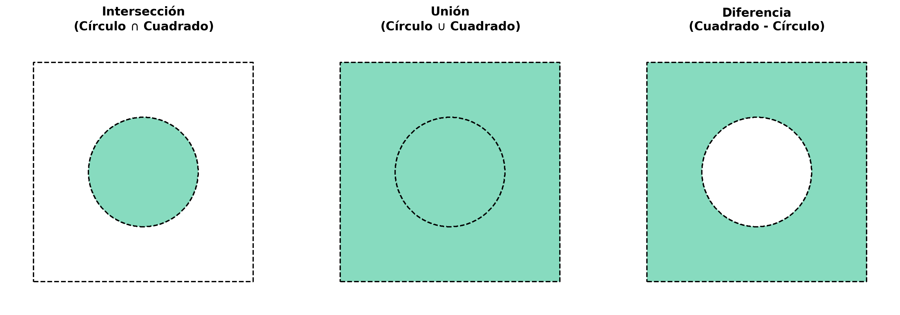
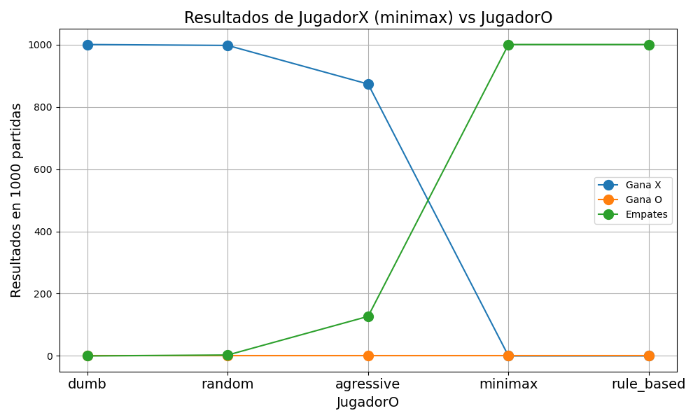

<style>
p {
    text-align: justify;
}

/* Estilo para el borde y el fondo general del callout */
div.callout.consola-terminal {
    background-color: #1e1e1e !important; /* Gris muy oscuro, estilo VS Code */
    border: 1px solid #444 !important;
    border-radius: 5px;
}

/* Estilo para la barra del título */
div.callout.consola-terminal .callout-header {
    background-color: #2d2d2d !important;
    color: #cccccc !important;
    font-family: 'Consolas', 'Courier New', monospace;
    border-bottom: 1px solid #444 !important;
}

/* Estilo para el texto de la salida (cuerpo) */
div.callout.consola-terminal .callout-body-container {
    color: #10B981 !important; /* Verde brillante estilo Matrix/Consola clásica */
    font-family: 'Consolas', 'Courier New', monospace;
    font-size: 0.95em;
}

/* Contenedor título + botón de descarga */
.exercise-title-row {
	display: flex;
	align-items: center;
	gap: 0.75rem;
	flex-wrap: wrap;
}

.exercise-download-btn {
	font-size: 0.85rem;
	text-decoration: none;
	border: 1px solid #0d6efd;
	color: #0d6efd;
	border-radius: 6px;
	padding: 0.2rem 0.55rem;
	line-height: 1.2;
	transition: all 0.15s ease;
}

.exercise-download-btn:hover {
	background-color: #0d6efd;
	color: #ffffff;
	text-decoration: none;
}

@media (max-width: 640px) {
	.exercise-download-btn {
		font-size: 0.8rem;
	}
}
</style>

<script>
document.addEventListener("DOMContentLoaded", function() {
	const downloadMap = {
		"Ejercicio 1: Formas geométricas": [{ file: "ej1.cpp", label: "Descargar ej1.cpp" }],
		"Ejercicio 2: Vectores generales": [{ file: "ej2.cpp", label: "Descargar ej2.cpp" }],
		"Ejercicio 3: tic-tac-toe general": [{ file: "ej3.cpp", label: "Descargar ej3.cpp" }]
	};

	const headings = document.querySelectorAll("main h2");

	headings.forEach((h2) => {
		const title = h2.textContent.trim();
		const files = downloadMap[title];
		if (!files) return;

		const row = document.createElement("span");
		row.className = "exercise-title-row";

		const titleSpan = document.createElement("span");
		titleSpan.textContent = title;
		row.appendChild(titleSpan);

		files.forEach((item) => {
			const link = document.createElement("a");
			link.href = item.file;
			link.download = item.file;
			link.className = "exercise-download-btn";
			link.textContent = item.label;
			row.appendChild(link);
		});

		h2.textContent = "";
		h2.appendChild(row);
	});
});
</script>


# Estanislao Claucich

A continuación se presentan las soluciones a los ejercicios propuestos en el GTP4.


## Ejercicio 1: Formas geométricas

::: {.callout-note title="Consigna"}
Implementar la clase `geoshape_t` que represente formas geométricas en 2D. La clase debe incluir métodos para calcular el área, el centro de gravedad y la inercia polar de la forma. Se deben implementar al menos las siguientes formas: círculo, cuadrado, elipse y pentágono regular. A su vez, implementar funciones para calcular la intersección, unión y diferencia entre dos de estas figuras.
:::

### La clase abstracta `geoshape_t`

El núcleo de la resolución de este ejercicio se basa en explotar el concepto de **polimorfismo**. Se definió una clase puramente virtual `geoshape_t` que expone una interfaz común para todas las figuras geométricas 2D:

```cpp
class geoshape_t {
    public:
        // Bounding box
        virtual void bbox(vector<double> &bb)=0;

        // Is x inside shape?
        virtual bool inside(const vector<double> &x)=0;
};
```

Cualquier figura gráfica deberá implementar estos dos métodos: `bbox` (que retorna los límites del eje cartesiano rectangular que encierran a la figura) e `inside` (que determina si un punto `(x, y)` pertenece o no al interior de la misma).

### Integración numérica para el cálculo de propiedades

La principal ventaja del polimorfismo es que nos permite escribir funciones de cálculo genéricas que reciben una referencia a `geoshape_t` sin importar qué figura concreta se esté evaluando. Generando una grilla 2D (con un total configurable de particiones, $N=500$) en el dominio delimitado por el `bbox`, es posible aproximar cálculos complejos como el área, el centro de gravedad y la inercia polar contando y acumulando únicamente aquellos puntos de la grilla donde el método `g.inside(pt)` arroje `true`.

Como ejemplo, el cálculo del área se implementa iterando sobre esta grilla y acumulando los diferenciales $dx \cdot dy$:

```cpp
double area(geoshape_t &g) {
    vector<double> bb;
    g.bbox(bb);
    
    int N = 500; // Resolución de nuestra grilla de integración
    double dx = (bb[2] - bb[0]) / N;
    double dy = (bb[3] - bb[1]) / N;
    
    double a = 0.0;
    vector<double> pt(2);
    for (int i = 0; i < N; ++i) {
        pt[0] = bb[0] + (i + 0.5) * dx;
        for (int j = 0; j < N; ++j) {
            pt[1] = bb[1] + (j + 0.5) * dy;
            if (g.inside(pt)) {
                a += dx * dy;
            }
        }
    }
    return a;
}
```

De manera análoga, para el centroide (`grav_center`) y la inercia polar (`inertia`) sólo cambian los factores a multiplicar por cada paso incremental del área evaluada:

```cpp
vector<double> grav_center(geoshape_t &g) {
    vector<double> bb;
    g.bbox(bb);
    
    int N = 500;
    double dx = (bb[2] - bb[0]) / N;
    double dy = (bb[3] - bb[1]) / N;
    
    double a = 0.0, cx = 0.0, cy = 0.0;
    vector<double> pt(2);
    for (int i = 0; i < N; ++i) {
        pt[0] = bb[0] + (i + 0.5) * dx;
        for (int j = 0; j < N; ++j) {
            pt[1] = bb[1] + (j + 0.5) * dy;
            if (g.inside(pt)) {
                double dA = dx * dy;
                a += dA;
                cx += pt[0] * dA;
                cy += pt[1] * dA;
            }
        }
    }
    return {cx / a, cy / a};
}

double inertia(geoshape_t &g) {
    vector<double> cg = grav_center(g);
    vector<double> bb;
    g.bbox(bb);
    
    int N = 500;
    double dx = (bb[2] - bb[0]) / N;
    double dy = (bb[3] - bb[1]) / N;
    
    double I = 0.0;
    vector<double> pt(2);
    for (int i = 0; i < N; ++i) {
        pt[0] = bb[0] + (i + 0.5) * dx;
        for (int j = 0; j < N; ++j) {
            pt[1] = bb[1] + (j + 0.5) * dy;
            if (g.inside(pt)) {
                double r2 = pow(pt[0] - cg[0], 2) + pow(pt[1] - cg[1], 2);
                I += r2 * (dx * dy);
            }
        }
    }
    return I;
}
```


### Las figuras base

Con la arquitectura del polimorfismo lista, modelar las figuras se reduce a una tarea muy simple. Figuras primarias como `square_t`, `circle_t` y `ellipse_t` heredan de `geoshape_t` e implementan su propia lógica matemática rápida. 

```cpp
class circle_t : public geoshape_t {
    double cx, cy, radius;
public:
    circle_t(double cx, double cy, double r) : cx(cx), cy(cy), radius(r) {}
    
    void bbox(vector<double> &bb) override {
        bb = {cx - radius, cy - radius, cx + radius, cy + radius};
    }
    
    bool inside(const vector<double> &x) override {
        return pow(x[0] - cx, 2) + pow(x[1] - cy, 2) <= radius * radius;
    }
};

class circle_t : public geoshape_t {
    double cx, cy, radius;
public:
    circle_t(double cx, double cy, double r) : cx(cx), cy(cy), radius(r) {}
    
    void bbox(vector<double> &bb) override {
        bb = {cx - radius, cy - radius, cx + radius, cy + radius};
    }
    
    bool inside(const vector<double> &x) override {
        return pow(x[0] - cx, 2) + pow(x[1] - cy, 2) <= radius * radius;
    }
};

class ellipse_t : public geoshape_t {
    double cx, cy, rx, ry;
public:
    ellipse_t(double cx, double cy, double rx, double ry) 
        : cx(cx), cy(cy), rx(rx), ry(ry) {}
        
    void bbox(vector<double> &bb) override {
        bb = {cx - rx, cy - ry, cx + rx, cy + ry};
    }
    
    bool inside(const vector<double> &x) override {
        return pow((x[0] - cx) / rx, 2) + pow((x[1] - cy) / ry, 2) <= 1.0;
    }
};
```

En el caso particular de polígonos convexos (`convex_polygon_t`), la lógica de `inside()` requiere utilizar el **producto cruz 2D** entre el punto analizado y las sucesivas aristas dirigidas del polígono, para validar geométricamente que este punto recaiga todo el tiempo sobre el mismo semiplano proyectado:

```cpp
class convex_polygon_t : public geoshape_t {
    vector<double> pts;
public:
    convex_polygon_t(const vector<double> &xj) : pts(xj) {}
    
    void bbox(vector<double> &bb) override {
        if (pts.empty()) return;
        bb = {pts[0], pts[1], pts[0], pts[1]};
        for (size_t i = 2; i < pts.size(); i += 2) { // Iterar sobre los puntos x, y
            if (pts[i] < bb[0]) bb[0] = pts[i];
            if (pts[i] > bb[2]) bb[2] = pts[i];
            if (pts[i+1] < bb[1]) bb[1] = pts[i+1];
            if (pts[i+1] > bb[3]) bb[3] = pts[i+1];
        }
    }
    
    bool inside(const vector<double> &x) override {
        if (pts.size() < 6) return false; // Todo polígono debe tener al menos 3 vértices
        int sign = 0;
        size_t n = pts.size() / 2;
        // Producto cruz
        for (size_t i = 0; i < n; ++i) {
            double x1 = pts[2*i];
            double y1 = pts[2*i + 1];
            double x2 = pts[(2*i + 2) % (2*n)];
            double y2 = pts[(2*i + 3) % (2*n)];
            
            double dx = x2 - x1;
            double dy = y2 - y1;
            double cross = dx * (x[1] - y1) - dy * (x[0] - x1);
            
            if (cross != 0) {
                int param_sign = (cross > 0) ? 1 : -1;
                if (sign == 0) sign = param_sign;
                else if (sign != param_sign) return false;
            }
        }
        return true;
    }
};
```


### Operaciones booleanas entre figuras

Este diseño orientado a objetos posibilita armar operaciones Booleanas que compongan geometrías a partir de otras, combinándolas para calcular la solución gráfica con un bajo costo arquitectural. Para ello creamos rutinas Booleanas `intersection_t`, `union_t` y `difference_t`. 

Dichas clases almacenan en su interior una variable `vector<geoshape_t*> shapes;` y consiguen un comportamiento acoplado condicionando la regla del `inside()`. Analicemos el caso de la Intersección: para considerarse partícipe del sistema central, el punto evaluado debe recaer dentro del interior de la totalidad de las piezas referidas.

```cpp
class intersection_t : public geoshape_t {
public:
    vector<geoshape_t*> shapes;
    void bbox(vector<double> &bb) override {
        /* Se obtiene solapando y achicando recursivamente las cajas de las figuras... */
    }
    bool inside(const vector<double> &x) override {
        if (shapes.empty()) return false;
        for (auto* shape : shapes) {
            // El punto debe existir en TODAS las sub-figuras
            if (!shape->inside(x)) return false;
        }
        return true;
    }
};
```

Para comprobar la correcta implementación, se instanciaron 4 figuras diferentes sencillas donde sabemos previamente el resultado exacto de las distintas operaciones:

```cpp
// 1. Verificar Cuadrado (Lado L=2, centrado en el origen)
square_t sq(-1.0, -1.0, 1.0, 1.0);
double sq_area_exact = 2.0 * 2.0;
double sq_inertia_exact = (2.0 * pow(2.0, 3) / 12.0) + (2.0 * pow(2.0, 3) / 12.0);

// 2. Verificar Círculo (Radio R=2, centrado en el origen)
circle_t circ(0.0, 0.0, 2.0);
double pi = acos(-1.0);
double circ_area_exact = pi * pow(2.0, 2);
double circ_inertia_exact = pi * pow(2.0, 4) / 2.0;

// 3. Verificar Elipse (rx=2, ry=1, centrada en el origen)
ellipse_t el(0.0, 0.0, 2.0, 1.0);
double el_area_exact = pi * 2.0 * 1.0;
// Inercia de la elipse = I_x + I_y = (pi * rx * ry^3 / 4) + (pi * ry * rx^3 / 4)
double el_inertia_exact = (pi * 2.0 * pow(1.0, 3) / 4.0) + (pi * 1.0 * pow(2.0, 3) / 4.0);

// 4. Pentágono regular (R=2, centrado en el origen)
vector<double> pent_pts;
double R = 2.0;
for (int i = 0; i < 5; ++i) { // 5 vértices espaciados 72 grados
    pent_pts.push_back(R * cos(i * 2.0 * pi / 5.0));
    pent_pts.push_back(R * sin(i * 2.0 * pi / 5.0));
}
convex_polygon_t pent(pent_pts);

// Fórmulas exactas para un polígono regular de N lados circunscrito en un círculo de radio R
double pent_area_exact = (5.0 / 2.0) * pow(R, 2) * sin(2.0 * pi / 5.0);
double pent_inertia_exact = pent_area_exact * pow(R, 2) / 6.0 * (2.0 + cos(2.0 * pi / 5.0));
```

:::{.callout-note .consola-terminal icon=false title="bash"}
--- Cuadrado (L=2) ---  
Area (Num / Exacta): 4.0000 / 4.0000  
Centro de Gravedad: (0.0000, 0.0000) / Exacto: (0.0000, 0.0000)  
Inercia (Num / Exacta): 2.6667 / 2.6667  

--- Circulo (R=2) ---  
Area (Num / Exacta): 12.5663 / 12.5664  
Centro de Gravedad: (0.0000, 0.0000) / Exacto: (0.0000, 0.0000)  
Inercia (Num / Exacta): 25.1325 / 25.1327  

--- Interseccion (Circulo inscrito en Cuadrado) ---  
Area (Num / Exacta): 3.1416 / 3.1416 (Area del Circulo)  

--- Union (Circulo inscrito en Cuadrado) ---  
Area (Num / Exacta): 16.0000 / 16.0000 (Area del Cuadrado)  

--- Pentagono Regular (R=2) ---  
Area (Num / Exacta): 9.5106 / 9.5106  
Centro de Gravedad: (0.0000, 0.0000) / Exacto: (0.0000, 0.0000)  
Inercia (Num / Exacta): 20.8986 / 20.8986  
:::


Se comprueban las operaciones booleanas con un caso simple y controlado. Un círculo de radio 1 inscripto en un cuadrado de lado 4, donde el área de la intersección debe ser igual al área del círculo y el área de la unión debe ser igual al área del cuadrado:



```cpp
// Cuadrado de 4x4 centrado en el origen
square_t bsq(-2.0, -2.0, 2.0, 2.0); 
// Círculo de R=1 centrado en el origen
circle_t bcirc(0.0, 0.0, 1.0);      

intersection_t inter;
inter.shapes.push_back(&bsq);
inter.shapes.push_back(&bcirc);

union_t uni;
uni.shapes.push_back(&bsq);
uni.shapes.push_back(&bcirc);

difference_t diff;
diff.shapes.push_back(&bsq);
diff.shapes.push_back(&bcirc);
```

:::{.callout-note .consola-terminal icon=false title="bash"}
--- Interseccion (Circulo inscrito en Cuadrado) ---  
Area (Num / Exacta): 3.1418 / 3.1416 (Area del Circulo)  

--- Union (Circulo inscrito en Cuadrado) ---  
Area (Num / Exacta): 16.0000 / 16.0000 (Area del Cuadrado)  

--- Diferencia (Cuadrado menos Circulo) ---  
Area (Num / Exacta): 12.8589 / 12.8584  
:::


## Ejercicio 2: Vectores generales

::: {.callout-note title="Consigna"}
Escribir una clase polimórfica para representar vectores. Se deben implementar los vectores `fullvec_t` (almacena todos los elementos), `stride_t` (almacena un valor inicial, un paso y la cantidad de elementos) y `sparse_t` (almacena la cantidad total de elementos, un vector con los índices de los elementos no nulos y otro vector con los valores correspondientes). Implementar funciones para calcular el número de elementos no nulos, la suma, el máximo y el mínimo de los elementos del vector. Además, implementar una función `reduce` que reciba un vector y una operación asociativa (suma, máximo o mínimo) y devuelva el resultado de aplicar esa operación a todos los elementos del vector.
:::

### La clase abstracta `vector_t`

De manera análoga al ejercicio anterior, definimos una interfaz base abstracta `vector_t`. Su objetivo es ocultar cómo se guardan realmente los elementos en memoria, forzando a que todo tipo de vector responda únicamente a dos consultas básicas: `size()` (obtener la longitud del vector) y el sobrecargado `operator[]` (obtener el valor alojado en la posición `i`).

```cpp
class vector_t {
    public:
        virtual int size() = 0;
        virtual double operator[ ](int i) = 0;
};
```

Con esta interfaz, se implementaron rutinas genéricas (`non_null`, `sum`, `max`, `min`) que operan ciegamente sobre referencias `vector_t &v`. Iterando hasta su respectivo `.size()`, y utilizando su sobrecarga dinámica de indexado `v[i]`. De esta forma, podemos calcular estas propiedades sin importar cuál es la naturaleza de almacenamiento del vector en particular:

```cpp
int non_null(vector_t &v) {
    int count = 0;
    for (int i = 0; i < v.size(); ++i) {
        if (v[i] != 0.0) count++;
    }
    return count;
}

double sum(vector_t &v) {
    double total = 0.0;
    for (int i = 0; i < v.size(); ++i) {
        total += v[i];
    }
    return total;
}

double max(vector_t &v) {
    if (v.size() == 0) return numeric_limits<double>::lowest();
    double current_max = v[0];
    for (int i = 1; i < v.size(); ++i) {
        if (v[i] > current_max) current_max = v[i];
    }
    return current_max;
}

double min(vector_t &v) {
    if (v.size() == 0) return numeric_limits<double>::max();
    double current_min = v[0];
    for (int i = 1; i < v.size(); ++i) {
        if (v[i] < current_min) current_min = v[i];
    }
    return current_min;
}
```

### Diferentes vectores

Se definieron tres tipos de vectores:

1. **`fullvec_t`**: Un vector denso clásico:

```cpp
class fullvec_t : public vector_t {
    private:
        vector<double> w;
    public:
        fullvec_t(int sz) : w(sz, 0.0) {}
        fullvec_t(const vector<double>& vec) : w(vec) {}

        int size() override {
            return w.size();
        }

        double operator[](int i) override {
            return w[i];
        }
};
```

2. **`stride_t`**: No guarda valores individualizados sino su definición matemática secuencial pura (`start`, `inc`, `size`). Resulta sumamente eficiente en memoria, permitiendo emular millones de puntos usando sólo tres variables escalares con una resolución al vuelo:

```cpp
class stride_t : public vector_t {
    private:
        double start;
        double inc;
        int sz;
    public:
        stride_t(double start, double inc, int sz) : start(start), inc(inc), sz(sz) {}

        int size() override {
            return sz;
        }

        double operator[](int i) override {
            return start + i * inc;
        }
};
```

3. **`sparse_t`**: Vector ralo. Está diseñado para conjuntos masivos compuestos mayoritariamente por ceros absolutos, para ahorrar RAM. En lugar de un arreglo denso masivo, conserva dos arreglos limitados a la par: los índices afectados (`indx`) y sus respectivos valores numéricos (`vals`). Al pedir una posición no listada, asume implícitamente `0.0`.

```cpp
class sparse_t : public vector_t {
    private:
        int sz;
        vector<int> indx;
        vector<double> vals;
    public:
        sparse_t(int sz, const vector<int>& indx, const vector<double>& vals) 
            : sz(sz), indx(indx), vals(vals) {}

        int size() override {
            return sz;
        }

        double operator[](int i) override {
            // Buscamos si el índice existe en los valores definidos
            for (size_t k = 0; k < indx.size(); ++k) {
                if (indx[k] == i) {
                    return vals[k];
                }
            }
            // Si es un índice no registrado, implícitamente vale nulo (0.0)
            return 0.0;
        }
};
```

Vemos una simple prueba de la funcionalidad implementada:

```cpp
fullvec_t fv({1.0, 0.0, -3.0, 4.0, 0.0});
// 0, 0.5, 1.0, 1.5, 2.0
stride_t sv(0, 0.5, 5); 
// Vector de 100 ptos, solo 3 elementos no nulos
sparse_t spv(100, {5, 50, 99}, {-3.0, 0.0, 8.0}); 
```

:::{.callout-note .consola-terminal icon=false title="bash"}
--- Full Vector ---  
Non nulls: 3 | Sum: 2 | Max: 4 | Min: -3  

--- Stride Vector ---  
Non nulls: 4 | Sum: 5 | Max: 2 | Min: 0  

--- Sparse Vector ---  
Non nulls: 2 | Sum: 5 | Max: 8 | Min: -3  
:::


### Reducción funcional y clases asociativas
    
Para generalizar al máximo operaciones repetitivas (como la suma o la búsqueda del valor máximo en una sola función universal `reduce`), se empleó la inyección de dependencias mediante la clase abstracta `assoc_t`. Esta clase porta un elemento neutro `null()` y una función binaria asociativa `g(x, y)`.

```cpp
class assoc_t {
    public:
        virtual double g(double x,double y)=0;
        virtual double null()=0;
};

class sum_t : public assoc_t {
    public:
        double g(double x,double y) override { return x+y; }
        double null() override { return 0; }
};

class max_t : public assoc_t {
    public:
        double g(double x,double y) override { return (x > y) ? x : y; }
        double null() override { return numeric_limits<double>::lowest(); }
};

class min_t : public assoc_t {
    public:
        double g(double x,double y) override { return (x < y) ? x : y; }
        double null() override { return numeric_limits<double>::max(); }
};

double reduce(vector_t &v, assoc_t &op) {
    if (v.size() == 0) return op.null();
    
    double result = op.null();
    for (int i = 0; i < v.size(); ++i) {
        result = op.g(result, v[i]);
    }
    return result;
}
```

Pudiendo crear derivados simples como un `sum_t` que sume o un `max_t`, logramos que al instanciar herramientas abstractas sobre esta rutina genérica, se computen los mismos resultados analíticos deseados que antes pero sin necesidad de mantener múltiples ciclos iteradores idénticos recorriendo nuestra memoria.

:::{.callout-note .consola-terminal icon=false title="bash"}
--- Prueba Reduce (Sparse Vector) ---  
Reduce Sum: 5.0000  
Reduce Max: 8.0000  
Reduce Min: -3.0000  
:::


## Ejercicio 3: tic-tac-toe general

:::{.callout-note title="Consigna"}
A partir del GTP anterior de tic-tac-toe, generalizar los jugadores a partir de una clase `player_t` que permita simplificar la implementación de la interacción entre jugadores diferentes.  
Implementar un sistema de competencia, comenzando desde octavos de final, donde se enfrentarán jugadores aleatorios entre sí, realizando $N$ partidas entre sí y obteniendo un ganador. Además, sortear las ventajas invirtiendo los turnos iniciales y administrar la memoria borrando a los perdedores en el proceso.
:::

### La clase abstracta `player_t`

Para generalizar el comportamiento de los diferentes agentes virtuales que juegan al tic-tac-toe, se diseñó una clase abstracta pura `player_t` de la cual deban heredar forzosamente todas las estrategias implementadas en módulos anteriores.

Esta interfaz los obliga a tener una variable con un nombre universal y la definición de su lógica de turno subyacente matemáticamente a través del método `move`. Asimismo, declara un destructor `virtual` para habilitar el manejo de la jerarquía polimórfica sin generar fugas de memoria remanentes al tratar de emplear `delete` usando su tipo padre (`player_t`):

```cpp
class player_t {
    protected:
        string name;
    public:
        player_t(string id = "") : name(id) {}
        virtual int move(board_t &b, int me) = 0;
        virtual string label() { return name; }
};
```

Con esto, las heurísticas previas (`dumb_t`, `random_t`, `agressive_t`, `minimax_t` y `rule_based_t`) asumen prefijos de registro para ser fácilmente identificables (e.g. `minimax_14`) y extienden de ella.

### Playoffs

El modelo orientado a objetos (donde tácticas concretas devienen abstractamente un simple `player_t*`) consigue que a la función principal encargada de las mecánicas no le importe a quiénes maneja:

```cpp
vector<int> match(player_t &playX, player_t &playO, int n_matches=1, bool verbose=true)
```

Seguidamente, se formuló un sistema principal de `playoffs` donde competirán diferentes tipos de jugadores entre sí y se obtendrá un campeón. Como el juego tiene una pequeña ventaja por quien comienza, se juegan $N$ partidas con cada jugador iniciando primero, para luego sumar los resultados y determinar un ganador estadístico:

```cpp
// Partidas donde p1 juega primero y donde p2 juega primero
vector<int> res1 = match(*p1, *p2, matches_per_round, false);
vector<int> res2 = match(*p2, *p1, matches_per_round, false);

// Sumatoria total de triunfos
int p1_wins = res1[0] + res2[1];
int p2_wins = res1[1] + res2[0];
int ties = res1[2] + res2[2];
```

En caso de que persista un total nivelado tras todas las rondas, el ganador se rifará aleatoriamente (`rand() % 2 == 0`). Además, tras decidir quién avanza a la siguiente ronda, el puntero heap del contrincante perdedor se purga dinámicamente llamando a su destructor (vía `delete p1/p2`) para no colapsar la RAM de cara a fases posteriores.

### Simulación de Torneo Aleatorio

En el `main`, se instancian `16` punteros conformando los octavos de final. Cada uno de estos agentes está designado ciegamente entre los 5 algoritmos disponibles. Puesto que los mejores agentes se abren paso inevitablemente por el filtro estadístico, es natural ver chocar a los `minimax` cerca de la cima para un desempate numérico total entre 20 simulaciones simultáneas probados como Cruz y luego otras 20 como Círculo:

```cpp
int main() {
    srand(time(NULL));
    vector<player_t*> tournament;
    
    // Octavos de final: 16 jugadores aleatorios
    for(int i = 1; i <= 16; i++) {
        int r = rand() % 5;
        string id = to_string(i);
        if (r == 0) tournament.push_back(new dumb_t(id));
        else if (r == 1) tournament.push_back(new random_t(id));
        else if (r == 2) tournament.push_back(new agressive_t(id));
        else if (r == 3) tournament.push_back(new minimax_t(id));
        else tournament.push_back(new rule_based_t(id));
    }
    
    player_t* champion = playoffs(tournament, 10);
    
    delete champion;
    return 0;
}
```

:::{.callout-note .consola-terminal icon=false title="bash"}
=== Ronda 1 (16 jugadores) ===  
minimax_1 vs random_2 -> Gana minimax_1 (20-0 y 0 empates)  
agressive_3 vs dumb_4 -> Gana agressive_3 (20-0 y 0 empates)  
rule_based_5 vs random_6 -> Gana rule_based_5 (18-1 y 1 empates)  
minimax_7 vs minimax_8 -> Empate (0-0), desempatando al azar -> minimax_8  
dumb_9 vs agressive_10 -> Gana agressive_10 (19-0 y 1 empates)  
random_11 vs minimax_12 -> Gana minimax_12 (19-0 y 1 empates)  
rule_based_13 vs rule_based_14 -> Empate (0-0), desempatando al azar -> rule_based_13  
dumb_15 vs random_16 -> Gana random_16 (16-1 y 3 empates)  

=== Ronda 2 (8 jugadores) ===  
minimax_1 vs agressive_3 -> Gana minimax_1 (20-0 y 0 empates)  
rule_based_5 vs minimax_8 -> Gana minimax_8 (14-0 y 6 empates)  
agressive_10 vs minimax_12 -> Gana minimax_12 (20-0 y 0 empates)  
rule_based_13 vs random_16 -> Gana rule_based_13 (17-1 y 2 empates)  

=== Ronda 3 (4 jugadores) ===  
minimax_1 vs minimax_8 -> Empate (0-0), desempatando al azar -> minimax_8  
minimax_12 vs rule_based_13 -> Gana minimax_12 (12-0 y 8 empates)  

=== Ronda 4 (2 jugadores) ===  
minimax_8 vs minimax_12 -> Empate (0-0), desempatando al azar -> minimax_12  

¡El ganador de los playoffs es minimax_12!  
:::


Siempre termina pasando que a la final llegan dos jugadores `minimax`. Y como vimos en el práctico anterior, cuando se enfrentan dos `minimax` con la misma profundidad de búsqueda, el resultado es un empate técnico (ver figura, punto minimax). Por lo tanto, el campeón se define por sorteo puro entre ambos finalistas.




Para hacerlo más interesante, simulamos un torneo donde no pueda haber jugadores `minimax`:

:::{.callout-note .consola-terminal icon=false title="bash"}
=== Ronda 1 (16 jugadores) ===  
random_1 vs random_2 -> Gana random_1 (11-6 y 3 empates)  
random_3 vs dumb_4 -> Gana dumb_4 (11-9 y 0 empates)  
dumb_5 vs agressive_6 -> Gana agressive_6 (19-0 y 1 empates)  
dumb_7 vs dumb_8 -> Empate (10-10), desempatando al azar -> dumb_8  
agressive_9 vs dumb_10 -> Gana agressive_9 (17-0 y 3 empates)  
agressive_11 vs random_12 -> Gana agressive_11 (17-0 y 3 empates)  
dumb_13 vs random_14 -> Gana dumb_13 (11-8 y 1 empates)  
random_15 vs random_16 -> Gana random_16 (11-9 y 0 empates)  

=== Ronda 2 (8 jugadores) ===  
random_1 vs dumb_4 -> Gana dumb_4 (12-7 y 1 empates)  
agressive_6 vs dumb_8 -> Gana agressive_6 (18-0 y 2 empates)  
agressive_9 vs agressive_11 -> Gana agressive_9 (4-3 y 13 empates)  
dumb_13 vs random_16 -> Gana dumb_13 (14-6 y 0 empates)  

=== Ronda 3 (4 jugadores) ===  
dumb_4 vs agressive_6 -> Gana agressive_6 (18-0 y 2 empates)  
agressive_9 vs dumb_13 -> Gana agressive_9 (18-0 y 2 empates)  

=== Ronda 4 (2 jugadores) ===  
agressive_6 vs agressive_9 -> Gana agressive_9 (8-1 y 11 empates)  

¡El ganador de los playoffs es agressive_9!  
:::