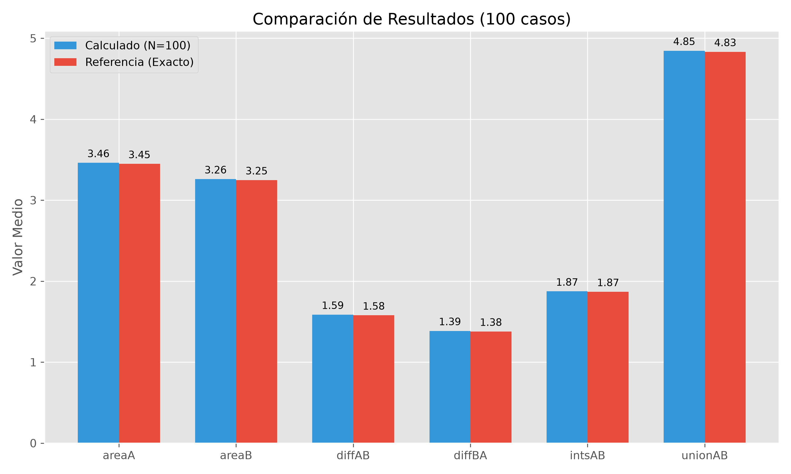
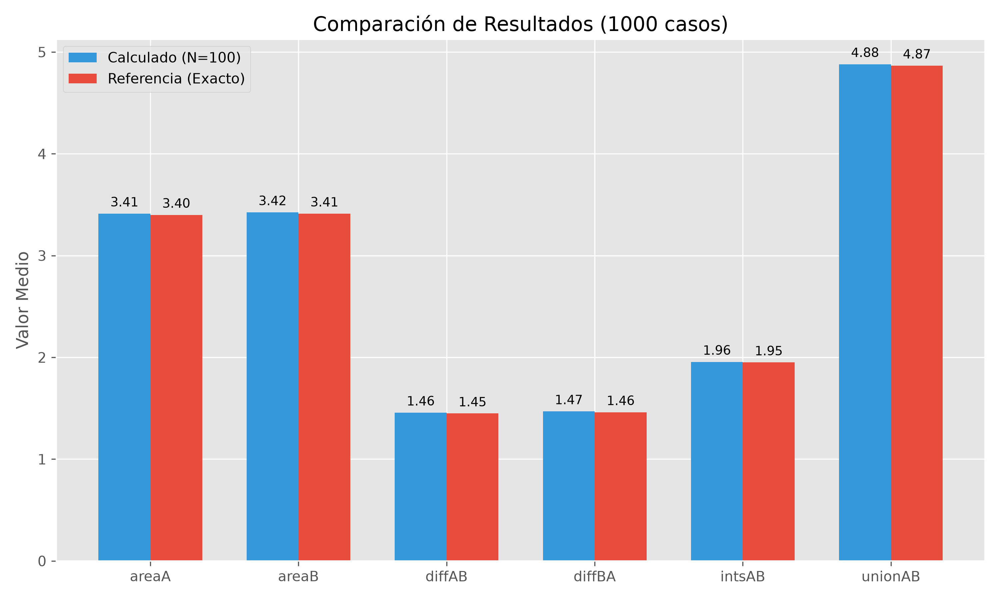

<style>
p {
    text-align: justify;
}

/* Estilo para el borde y el fondo general del callout */
div.callout.consola-terminal {
    background-color: #1e1e1e !important; /* Gris muy oscuro, estilo VS Code */
    border: 1px solid #444 !important;
    border-radius: 5px;
}

/* Estilo para la barra del título */
div.callout.consola-terminal .callout-header {
    background-color: #2d2d2d !important;
    color: #cccccc !important;
    font-family: 'Consolas', 'Courier New', monospace;
    border-bottom: 1px solid #444 !important;
}

/* Estilo para el texto de la salida (cuerpo) */
div.callout.consola-terminal .callout-body-container {
    color: #10B981 !important; /* Verde brillante estilo Matrix/Consola clásica */
    font-family: 'Consolas', 'Courier New', monospace;
    font-size: 0.95em;
}

/* Contenedor título + botón de descarga */
.exercise-title-row {
	display: flex;
	align-items: center;
	gap: 0.75rem;
	flex-wrap: wrap;
}

.exercise-download-btn {
	font-size: 0.85rem;
	text-decoration: none;
	border: 1px solid #0d6efd;
	color: #0d6efd;
	border-radius: 6px;
	padding: 0.2rem 0.55rem;
	line-height: 1.2;
	transition: all 0.15s ease;
}

.exercise-download-btn:hover {
	background-color: #0d6efd;
	color: #ffffff;
	text-decoration: none;
}

@media (max-width: 640px) {
	.exercise-download-btn {
		font-size: 0.8rem;
	}
}
</style>

<script>
document.addEventListener("DOMContentLoaded", function() {
	const downloadMap = {
		"Ejercicio 1": [
            { file: "ej1.cpp", label: "Descargar ej1.cpp" },
            { file: "input100.h5", label: "Descargar input100.h5" },
            { file: "outputref100.h5", label: "Descargar outputref100.h5" },
            { file: "input1000.h5", label: "Descargar input1000.h5" },
            { file: "outputref1000.h5", label: "Descargar outputref1000.h5" },
            { file: "output100.h5", label: "Descargar output100.h5" },
            { file: "output1000.h5", label: "Descargar output1000.h5" },
            { file: "plot_results.py", label: "Descargar script Python (plot)" }
        ]
	};

	const headings = document.querySelectorAll("main h2");

	headings.forEach((h2) => {
		const title = h2.textContent.trim();
		const files = downloadMap[title];
		if (!files) return;

		const row = document.createElement("span");
		row.className = "exercise-title-row";

		const titleSpan = document.createElement("span");
		titleSpan.textContent = title;
		row.appendChild(titleSpan);

		files.forEach((item) => {
			const link = document.createElement("a");
			link.href = item.file;
			link.download = item.file;
			link.className = "exercise-download-btn";
			link.textContent = item.label;
			row.appendChild(link);
		});

		h2.textContent = "";
		h2.appendChild(row);
	});
});
</script>

A continuación se presenta la solución propuesta para la GTP7, enfocada en el uso de archivos HDF5.

## Ejercicio 1

::: {.callout-note title="Consigna"}
Desarrollar un programa que procese un archivo HDF5 de entrada con información geométrica de `ncases` pares de círculos (coordenadas de centros y radios). Para cada par, realizar los cálculos de área correspondientes definidos en los GTPs previos (intersecciones, uniones, etc.) empleando una grilla de $N=100$. Finalmente, almacenar los arreglos resultantes en un archivo `output.h5` y verificar estadísticamente su exactitud contra los archivos de referencia (`outputref100.h5` y `outputref1000.h5`) calculando la media del error y la raíz cuadrada del error cuadrático medio (RMSE).
:::

### 1. Exploración Inicial de Datos HDF5

El formato HDF5 (_Hierarchical Data Format_) es altamente eficiente para el manejo de volúmenes masivos de información. Cuenta con una estructura jerárquica similar a un sistema de archivos, donde podemos ubicar distintos `Dataset` que alojan los arreglos de valores puros, agrupados de manera optimizada y con su metadata integrada. 

En primera instancia, se realizó una exploración de los archivos de entrada de referencia para conocer su estructura. Para esto se usaron las herramientas `h5ls` y `h5dump` que nos permiten visualizar la información contenida en estos archivos, que de otra forma sería ilegible. Por ejemplo, podemos inspeccionar el archivo `input100.h5` directamente:

:::{.callout-note .consola-terminal icon=false title="bash"}
``` bash
$ h5ls input100.h5  
R1                       Dataset {1, 100}  
R2                       Dataset {1, 100}  
x1                       Dataset {100, 2}  
x2                       Dataset {100, 2}  
```
:::

A partir de esta salida, inferimos los tipos y formas de nuestros datos: las variables de los radios (`R1` y `R2`) son vectores unidimensionales de longitud igual al número de casos ($1 \times 100$), mientras que los centros (`x1` y `x2`) son matrices bidimensionales ($100 \times 2$) alojando las coordenadas $x, y$. 

Adicionalmente, podemos inspeccionar un segmento crudo de los datos de cualquiera de las variables utilizando `h5dump` filtrando por el nombre de los dataset:

:::{.callout-note .consola-terminal icon=false title="bash"}
``` bash
$ h5dump -d /R1 input100.h5  
HDF5 "input100.h5" {  
DATASET "/R1" {  
   DATATYPE  H5T_IEEE_F64LE  
   DATASPACE  SIMPLE { ( 1, 100 ) / ( 1, 100 ) }  
   DATA {  
   (0,0): 1.4486, 0.694075, 0.503988, 0.988214, 0.766986, 0.748473, 1.05316,  
   (0,7): 1.16621, 1.07806, 1.02114, 1.32657, 0.912381, 1.1546, 1.31596,  
   ...  
   (0,96): 0.78998, 0.571255, 0.717054, 0.837344  
   }  
}  
}  
```
:::

### 2. Desarrollo del Código (API Orientada a Objetos)

Para interactuar con el formato HDF5 se optó por la **API de C++ de HDF5** (`H5Cpp.h`). Esta API sigue una filosofía de encapsulación Orientada a Objetos, donde las estructuras principales (`H5File`, `DataSet` y `DataSpace`) son clases nativas.

#### Lectura

Se implementó una función genérica `read_h5_dataset` que recibe un objeto instanciado de archivo, el nombre de un `DataSet` particular y el número total de elementos esperados. A partir de allí, se solicita a la librería la lectura del segmento utilizando memoria contigua de tipo `double`:

```cpp
vector<double> read_h5_dataset(const H5File& file, const string& dataset_name, size_t expected_size) {
    DataSet dataset = file.openDataSet(dataset_name);
    vector<double> data(expected_size);
    dataset.read(data.data(), PredType::NATIVE_DOUBLE);
    return data;
}
```

La cantidad de casos dinámicos (`ncases`) a iterar se obtiene al arrancar el programa. Tomando el espacio de dimensiones (_DataSpace_) de cualquier matriz base (por ej. `R1`), podemos iterar sobre los límites simples (`getSimpleExtentDims`) y calcular su cardinalidad.

```cpp
H5File in_file(input_file, H5F_ACC_RDONLY);
DataSet dset = in_file.openDataSet("R1");
DataSpace dspace = dset.getSpace();
int ndims = dspace.getSimpleExtentNdims();

vector<hsize_t> dims(ndims);
dspace.getSimpleExtentDims(dims.data(), NULL);

size_t ncases = 1;
for (int i=0; i<ndims; ++i) ncases *= dims[i];
```

#### Cálculos Geométricos y Escritura

Una vez almacenadas las 4 variables en arreglos `std::vector<double>`, se iteran dinámicamente y se configuran las clases polimórficas de círculos y uniones (`circle_t`, `intersection_t`, `difference_t` y `union_t`) reutilizadas del GTP6 para extraer un cálculo final de cada área aproximada de grilla ($N=100$). Los resultados para los 100 casos se consolidan en nuevos `DataSet` de salida:

```cpp
void write_h5_dataset(H5File& file, const string& dataset_name, const vector<double>& data) {
    hsize_t dims[1] = {data.size()};
    DataSpace dataspace(1, dims);
    DataSet dataset = file.createDataSet(dataset_name, PredType::NATIVE_DOUBLE, dataspace);
    dataset.write(data.data(), PredType::NATIVE_DOUBLE);
}
```

### 3. Ejecución y Verificación 

El programa `ej1.cpp` recibe por argumentos de línea de comandos tanto el archivo a procesar como el archivo de referencia que almacena los valores matemáticos exactos a validar. Para corroborar el correcto funcionamiento y uso de los archivos, tenemos las salidas de referencia esperadas (ground truth) para el caso 100 y el caso 1000. Durante la validación, el programa calculará 4 métricas estadísticas fundamentales comparando nuestros resultados numéricos (obtenidos por integración en grilla) con la referencia matemática exacta:

1. El **Error Absoluto Medio** entre los valores obtenidos y los valores de referencia.
2. La **Media** de los valores obtenidos frente a la media de los de referencia.
3. La **Media de los Cuadrados** de los valores obtenidos frente a la misma para los de referencia.
4. La **Media de las Raíces Cuadradas** de los valores obtenidos frente a la misma para los de referencia.

Si ejecutamos el proyecto contra los casos proporcionados por `input100.h5` y `input1000.h5`, obtendremos:

::: {.callout-note appearance="minimal" icon="false" collapse="false" class="consola-terminal"}
## terminal
```bash
$ ./ej1 input100.h5 outputref100.h5
Leyendo de input100.h5...
Procesando 100 casos...
Resultados guardados en output.h5.

Verificando contra outputref100.h5...
Estadísticas de error para areaA:
  Error Absoluto Medio: 0.0128531
  Media: calc = 3.46095 | ref = 3.4481
  Media de los Cuadrados: calc = 15.4778 | ref = 15.3627
  Media de las Raíces Cuadradas: calc = 1.78444 | ref = 1.78113

Estadísticas de error para areaB:
  Error Absoluto Medio: 0.0120674
  Media: calc = 3.25999 | ref = 3.24792
  Media de los Cuadrados: calc = 13.8526 | ref = 13.7499
  Media de las Raíces Cuadradas: calc = 1.73567 | ref = 1.73246

Estadísticas de error para diffAB:
  Error Absoluto Medio: 0.00860359
  Media: calc = 1.58709 | ref = 1.57849
  Media de los Cuadrados: calc = 4.4992 | ref = 4.45303
  Media de las Raíces Cuadradas: calc = 1.08257 | ref = 1.07943

Estadísticas de error para diffBA:
  Error Absoluto Medio: 0.00788576
  Media: calc = 1.38622 | ref = 1.37834
  Media de los Cuadrados: calc = 3.76495 | ref = 3.72569
  Media de las Raíces Cuadradas: calc = 0.9792 | ref = 0.976196

Estadísticas de error para intsAB:
  Error Absoluto Medio: 0.00534784
  Media: calc = 1.87417 | ref = 1.86882
  Media de los Cuadrados: calc = 4.99868 | ref = 4.97054
  Media de las Raíces Cuadradas: calc = 1.30227 | ref = 1.30041

Estadísticas de error para unionAB:
  Error Absoluto Medio: 0.0142703
  Media: calc = 4.84585 | ref = 4.83158
  Media de los Cuadrados: calc = 26.32 | ref = 26.1669
  Media de las Raíces Cuadradas: calc = 2.16522 | ref = 2.16202

$ ./ej1 input1000.h5 outputref1000.h5
Leyendo de input1000.h5...
Procesando 1000 casos...
Resultados guardados en output.h5.

Verificando contra outputref1000.h5...
Estadísticas de error para areaA:
  Error Absoluto Medio: 0.0127401
  Media: calc = 3.41228 | ref = 3.39954
  Media de los Cuadrados: calc = 15.1359 | ref = 15.0229
  Media de las Raíces Cuadradas: calc = 1.77235 | ref = 1.76905

Estadísticas de error para areaB:
  Error Absoluto Medio: 0.0128434
  Media: calc = 3.42474 | ref = 3.41189
  Media de los Cuadrados: calc = 15.0616 | ref = 14.9485
  Media de las Raíces Cuadradas: calc = 1.77953 | ref = 1.7762

Estadísticas de error para diffAB:
  Error Absoluto Medio: 0.00830668
  Media: calc = 1.45699 | ref = 1.4487
  Media de los Cuadrados: calc = 4.44916 | ref = 4.40344
  Media de las Raíces Cuadradas: calc = 0.988176 | ref = 0.984939

Estadísticas de error para diffBA:
  Error Absoluto Medio: 0.00872324
  Media: calc = 1.46956 | ref = 1.46084
  Media de los Cuadrados: calc = 4.14311 | ref = 4.09856
  Media de las Raíces Cuadradas: calc = 1.01694 | ref = 1.01349

Estadísticas de error para intsAB:
  Error Absoluto Medio: 0.00575915
  Media: calc = 1.95566 | ref = 1.94991
  Media de los Cuadrados: calc = 5.18276 | ref = 5.15248
  Media de las Raíces Cuadradas: calc = 1.33774 | ref = 1.33577

Estadísticas de error para unionAB:
  Error Absoluto Medio: 0.0146829
  Media: calc = 4.88054 | ref = 4.86586
  Media de los Cuadrados: calc = 26.6816 | ref = 26.5205
  Media de las Raíces Cuadradas: calc = 2.17194 | ref = 2.16868
```
:::

Los valores computados presentan un nivel de error medio sumamente aceptable ($\sim 0.01$), lo cual se justifica y está inherentemente vinculado a la discretización numérica en grillas regulares de $N=100$ empleada para la integración del área por cajas cartesianas. Analizando los promedios ("Media"), se observa cómo las curvas generadas por nuestra implementación se solapan casi idénticamente sobre los valores exactos.

A continuación, se adjunta un script auxiliar en Python que, valiéndose de la librería `h5py` y `matplotlib`, extrae estos estadísticos de los archivos generados y los ilustra en gráficos de barras, contrastando nuestra salida numérica contra los valores analíticos (referencia) para ambos archivos de entrada.





Como se puede apreciar lado a lado en la gráfica, el programa valida y gestiona exitosamente miles de componentes jerárquicos, logrando aproximaciones equivalentes utilizando las implementaciones modernas de HDF5 en C++.